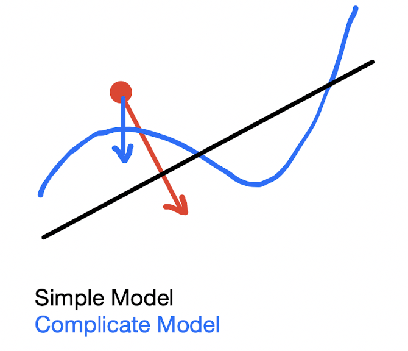

# Adversarial Attack on FashionMNIST

In this project, we tried to perfrom adversarial attack on ```FashionMNIST``` dataset (https://github.com/zalandoresearch/fashion-mnist), which consists of 60k/10k (Train/Test) 28*28-pixel pics separated into 10 classes.

## Introduction

 Our goal can be described as the following steps:

- Train a just-so-so model on ```FashionMNIST``` (with 90%+ accuracy performance on test set)
- Attack this model: Add some noises to our samples in test set, in order to confuse our model to predict these samples from class i to class (i+1)%10.
  - In both white box and black box manner.
- Re-train our model with both the original dataset and the attacked samples, in order to check if our model has become more robust with the attacked samples.
- Re-attack the re-trained model. (Adversarial Attack!)

We trained two different models:

- Three-Layer Convolution (BN/ReLU/Global AvgPool) + Full Connection (Dropout)
- ResNet18 (BN/ReLU/Global AvgPool/Downsampling) + Full Connection (Dropout)

to conduct the experiments above. We will report our experiment results in this file.

## Files & Directories:

- ```convModel.py```: Three-Layer Convolution model
- ```ResNet18.py```: ResNet18 model
- ```train.py```: training model
- ```attack.py```: attacking model
- ```ckpt/```: the saved checkpoint for different models.
- ```FashionMNIST/```: the dataset directory.
- ```learning curve/```: the saved learning curves for different models.
- ```attack_result/```: (randomly selected) attacked samples from different classes. Pics in this directory is named ```a_b.jpg```, which means this pic is originally in class ```a```, but is predicted to class ```b``` after noised added.

## Results:

We provided **Test Acc. (Trained Before Attack)**, **Test Acc. (With Attacked Data)** in the chart below. And the corresponding attacked samples is saved in directory ```attack_result/```.

|                                        | 3-Layer conv | ResNet18 |
| -------------------------------------- | ------------ | -------- |
| Test Acc. (Trained before attack)      | 90.81%       | 92.29%   |
| Test Acc. (Trained with attacked data) | 93.89%       | 94.56%   |

From the chart above, we can see that the models have become much more robust after adding attacked data.

We provided **Attack Success Rate (Whitebox/ Blackbox)**, **Re-attack Succes Rate (Whitebox/ Blackbox)** in the chart below. The attack was done on 1,000 correctly predicted test set samples (Marked as ```Test``` in chart), or 1,000 given samples in ```correct1k.pkl``` file (Marked as ```Given``` in chart). And the corresponding attacked samples is saved in directory ```attack_result/```.

|                                       | 3-Layer conv | ResNet18 |
| ------------------------------------- | ------------ | -------- |
| Attack Succ. Rate (Test/Whitebox)     | 88.50%       | 88.10%   |
| Attack Succ. Rate (Test/Blackbox)     | 29.50%       | 58.20%   |
| Re-Attack Succ. Rate (Test/Whitebox)  | 78.50%       | 86.90%   |
| Re-Attack Succ. Rate (Test/Blackbox)  | 29.40%       | 54.60%   |
| Attack Succ. Rate (Given/Blackbox)    | /            | 64.80%   |
| Re-Attack Succ. Rate (Given/Blackbox) | /            | 58.10%   |

We can draw several interesting **conclusions** from the results:

- **White box attack can reach a higher success rate than Black box manner**: The gradient is always a good instructor on generating noises!
- **After re-train with attacked data, the models become more robust and harder to attack:** Data augmentation is necessary to enhance model robustness and performance!
- **The more simpler the model, the harder the attack**: That's because the inter-class margin learned by a simple model can be softer than a complicated one. Therefore, we need to apply more noises to drag the sample to another class.



## Wanna try to attack?

Simply run the cmdlines below! You can try different experiment settings using different parameters.

Train the model:

```
python ./train.py 
--epochs: Training Epochs, default=150, type=int
--batch_size: Mini-Batch size, default=200, type=int
--lr, Learning rate, default=2e-3, type=float
--backbone, Model Backbone, default='resnet', type=str, only support 'resnet' and '3_conv'
--train_with_attacked_data, if labeled in cmdline, the attacked dataset will be concatenated into the training set.
--test, if labeled in cmdline, the program will do test phase only.
```

Run attack:

```
python ./attack.py
--mode, Attack mode, default="blackbox", type=str, only support "blackbox" and "whitebox"
--backbone, Model to attack on, default='resnet', type=str, only support 'resnet' and '3_conv'
--attack_epochs, Maximum attack trials: default=200, type=int
--train_with_attacked_data, if labeled in cmdline, we'll use the re-trained model (trained with attacked data) to attack.
--correct1k, if labeled in cmdline, we'll attack on given correct1k data.
```

